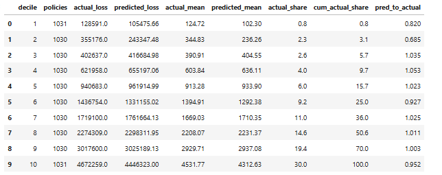

# Auto Insurance GLM Pricing (Frequency–Severity)

Frequency–severity GLM pricing model for auto insurance:
- Frequency: Negative Binomial GLM
- Claim occurrence: Binomial (Logit) GLM
- Severity: Gamma GLM  
Pure premium = frequency × severity

## Results
- Scored 10,302 policies and ranked risk via predicted pure premium
- Top decile captured ~30% of total losses (strong risk separation)
- Loss ratio separation ~36× between top and bottom deciles

## Decile lift

## Repository contents
- `AUTOGLM.ipynb` – model training + evaluation notebook
- `figures/` – plots and lift/decile results

## How to run
1. `pip install -r requirements.txt`
2. Open `AUTOGLM.ipynb` and run all cells

## Data
Data source (Kaggle):
https://www.kaggle.com/datasets/xiaomengsun/car-insurance-claim-data

File expected:
data/car_insurance_claim.csv
